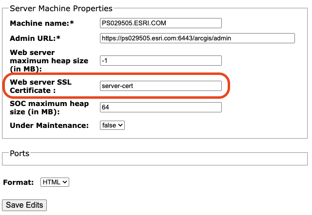

# Install ArcGIS Server on Linux

## Open Required Firewall Ports

Ensure that the necessary firewall ports are open for ArcGIS Server to function properly. The following opens ports 6443 for ArcGIS Server and 22 for SSH access.

``` bash
sudo ufw allow 6443
sudo ufw allow 22
sudo ufw enable
sudo ufw status
```

## Create ArcGIS User and Group

If you haven't already done so, create the `arcgis` user and group that will own and run ArcGIS Server. This example creates the `arcgis` user with a home directory of `/opt/arcgis`, so everything related to ArcGIS software is contained within the `/opt/arcgis` directory.

``` bash
sudo groupadd arcgis
sudo useradd -g arcgis -d /opt/arcgis arcgis
sudo mkdir /opt/arcgis
sudo chown arcgis:arcgis /opt/arcgis
sudo chmod 755 /opt/arcgis
```

Optionally, copy the bash profile to the new user's home directory.

``` bash
sudo cp ~/.bashrc /opt/arcgis/.bashrc
sudo chown arcgis:arcgis /opt/arcgis/.bashrc
```

## Set File Handle Limits

Set the lower file handle limits for the `arcgis` user by editing the `/etc/security/limits.conf` file.

``` bash
sudo nano /etc/security/limits.conf
```

Add the following lines to the end of the file:

``` bash
arcgis           soft    nofile          65535
arcgis           hard    nofile          unlimited
```

## Copy and Unpack Installation Files

Copy the ArcGIS Server installer from the mounted Esri software share to a local directory, such as `/tmp`, and unpack it.

``` bash
cp /mnt/software/120_Final/ArcGIS_Server_Linux_120_*.tar.gz /tmp
tar xvf /tmp/ArcGIS_Server_Linux_120*.tar.gz -C /tmp
```

Also, copy the license file to the local temporary directory.

``` bash
cp /mnt/software/Authorization_Files/Version12.0/ArcGIS_Server/Advanced/Server_Ent_Adv_AllExt.ecp /tmp
```

## Extend the `/opt` Volume (if necessary)

Check to ensure there is enough space on the `/opt` volume to install ArcGIS Server. If there is not enough space, extend the logical volume and resize the filesystem.

First, check the available space on the `/opt` volume.

``` bash
df -h /opt
```

There needs to be at least 20 GB of free space to install ArcGIS Server. If there is not enough space, extend the logical volume. When installing, I discovered only 20GB is allocated by default, so I extended it by an additional 10GB to have enough capacity.

``` bash
sudo lvextend -L +10G /dev/vg_os/lv_opt --resizefs
```

## Fix Hosts File

Ensure that the `/etc/hosts` file contains an entry for the server's hostname and IP address. Start by opening the `/etc/hosts` file in a text editor.

``` bash
sudo nano /etc/hosts
```

Next, search for a line similar to the following. In this case, my server's hostname is `PS029505.esri.com`.

``` bash
127.0.0.1 PS029505.esri.com PS029505 localhost
```

If you have a similar line, you can either update it to match your server's hostname or comment it out by adding a `#` at the beginning of the line, and add another line with just the localhost loopback entry as shown below.

``` bash
# 127.0.0.1 PS029505.esri.com PS029505 localhost
127.0.0.1       localhost
::1             localhost ip6-localhost ip6-loopback
```

!!! note "Why ArcGIS Server Needs This"

    ArcGIS Server uses the machine’s hostname when binding services, generating service URLs, validating tokens, and for inter‑node calls in a site. If your hostname resolves to loopback or the wrong NIC, you’ll see start‑up warnings, registration/federation issues, and health‑check failures.

## Install ArcGIS Server

Now, run the ArcGIS Server installer as the `arcgis` user.

!!! note "Install as `arcgis`"

    If not the `arcgis` user, use `sudo -u arcgis -s` to switch to the `arcgis` user before running the installer.

``` bash
/tmp/ArcGISServer/Setup -m silent -l yes -a /tmp/Server_Ent_Adv_AllExt.ecp -d /opt -v
```

!!! note "Install Path"

    The install path, `/opt`, is the parent directory where ArcGIS Server will be installed. The actual installation directory will be `/opt/arcgis/server` since the installer automatically creates the `arcgis` and `server` subdirectories.

## Software Authorization

Reference: [Authorize ArcGIS Server Silently](https://enterprise.arcgis.com/en/server/latest/install/linux/silently-install-arcgis-server.htm#ESRI_SECTION1_49ED6300B7144B35BFF3AB749743EB5F)

The `-a` parameter used when installing above specifies the path to the authorization file copied earlier. If included in the installation command, the software will be authorized automatically during installation. 

However, if you need to authorize the software later, you can do so using the `authorizeSoftware` command after installation. This also works if you need to update the authorization later.

## Create ArcGIS Server Site

Reference: [Createsite Command Line Utility](https://enterprise.arcgis.com/en/server/latest/install/linux/silently-install-arcgis-server.htm#ESRI_SECTION1_EDF7ACDDAD2842B2BA61BEBF712D3EB8)

Start by creating the directory where the ArcGIS Server site configuration will be stored.

``` bash
sudo mkdir -p /var/opt/arcgis/server
sudo chown -R arcgis:arcgis /var/opt/arcgis
```

Next, use the `createsite` command to create the ArcGIS Server site.

``` bash
sudo -u arcgis /opt/arcgis/server/tools/createsite/createsite.sh -d /var/opt/arcgis/server -c /opt/arcgis/server/usr/config-store -u serveradmin -p P@ssw0rd
```

## Configure Server for ArcGIS to Start at Boot

Reference: [Post-Installation Configuration](https://enterprise.arcgis.com/en/server/latest/install/linux/silently-install-arcgis-server.htm#ESRI_SECTION1_4B96E01A8AA344E3AD5E68A2DDBA8CA1)

Configure the ArcGIS Server service to start automatically when the system boots using systemd by copying the service file and enabling the service.

``` bash
sudo cp /opt/arcgis/server/framework/etc/scripts/arcgisserver.service /etc/systemd/system/
sudo chown root:root /etc/systemd/system/arcgisserver.service
sudo chmod 755 /etc/systemd/system/arcgisserver.service
sudo systemctl enable arcgisserver.service
sudo systemctl stop arcgisserver.service
sudo systemctl start arcgisserver.service
sudo systemctl status arcgisserver.service --no-pager
```

Now, you should be able to access the ArcGIS Server Manager at `https://server.domain.com:6443/arcgis/manager` using the `serveradmin` account created earlier.

## Install Certificates on ArcGIS Server (Optional)

Although optional, it is recommended to install SSL/TLS certificates on ArcGIS Server to secure communications. This involves obtaining a certificate from a trusted Certificate Authority (CA) and configuring ArcGIS Server to use it.

??? note "Get Esri Internal Domain Certificates"

    Domain certificates for internal Esri can be created and downloaded from [Esri CertiFactory](https://certifactory.esri.com/).

Next, login to ArcGIS Server Admin (https://server.domain.com:6443/arcgis/admin) and click on `machines`. Select the name of the server you just configured. Then click on `sslcertificates`.

On this page, upload both the CA certificate and the server certificate. The name of the server certificate does not matter. Just make sure you remember it for the next step.

After uploading the certificates, go back to the machine page and click on `edit`. In the form, type the name of the server certificate you uploaded in the previous step into the `Web server SSL Certificate` field. In the example below, I named my certificate `server-cert` when uploading in the previous step, so this is the name used here as well.



Click `Save and Restart` to apply the changes. ArcGIS Server will restart, and the new SSL/TLS certificate will be used for secure communications.

!!! note

    Typically, for the browser to recognize the certificate, the browser needs to be closed and reopened. Hence, close the current browser window and open a new one to access the ArcGIS Server Manager using the secure URL: `https://server.domain.com:6443/arcgis/manager`, and it should now show as secure.

## Configure ArcGIS Server Web Adaptor

Web Adapter configuration must be done on the web server where the web adaptor is installed. The following steps shall be performed on the web server where the ArcGIS Web Adaptor is installed.

Move the `arcgis.war` file to the Tomcat webapps directory, and rename it to `server.war`. When Tomcat restarts, it will deploy the web adaptor for Portal for ArcGIS as `https://<webserver.domain.com>/portal`.

``` bash
sudo cp /opt/arcgis/webadaptor*/java/arcgis.war /opt/tomcat/webapps/server.war
sudo chown tomcat:tomcat /opt/tomcat/webapps/server.war
```

Restart the Tomcat service to deploy the web adaptor.

``` bash
sudo systemctl restart tomcat
sudo systemctl status tomcat --no-pager
```

Since there is no GUI on the Linux server, use the command line interface to configure the web adaptor. Run the following command, replacing the placeholders with your actual values.

``` bash
/opt/arcgis/webadaptor12.0/java/tools/configurewebadaptor.sh -m server -w https://<webserver.domain.com>/server/webadaptor -g server.domain.com -u serveradmin -p P@ssw0rd
```

Reference: [Configure the ArcGIS Web Adaptor from the Command Line](https://enterprise.arcgis.com/en/web-adaptor/11.4/install/java-linux/configure-arcgis-web-adaptor-server.htm#GUID-5742E0C3-1C8D-4DA8-85AB-0385FB7C9E71)

## Verify the Installation

Now, you are ready to access the Server site. Open a web browser and navigate to `https://<webserver.domain.com>:6443/server`. Log in using the administrator account you created earlier to verify that the installation was successful.

## Federate the Server with Portal for ArcGIS

Reference: [Federate ArcGIS Server with Portal for ArcGIS](https://enterprise.arcgis.com/en/portal/latest/administer/windows/federate-arcgis-server-with-portal-for-arcgis.htm)

1. Log into the ArcGIS Portal (https://portal.domain.com/portal) using the administrator account created during the Portal installation. 

2. Navigate to `Organization` > `Settings` > `Servers` tab. Click on `Add Server` and select `ArcGIS Server`.

3. In the `Add ArcGIS Server` dialog, provide the following information follwing these patterns.
   
   - Service URL: `https://webadaptor.domain.com/server` (web adaptor URL)
   - Administration URL: `https://server.domain.com:6443/arcgis` (direct server URL)
   - Provide the `serveradmin` username and password created during the ArcGIS Server installation.

!!! note "Server Role"

    The server role cannot be set up yet, since the server has not been configured with a hosting data store. This will be done later after installing and configuring the ArcGIS Data Store.