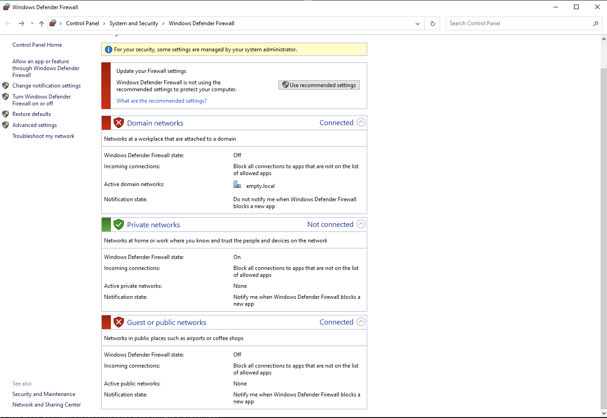
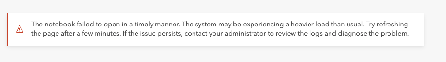
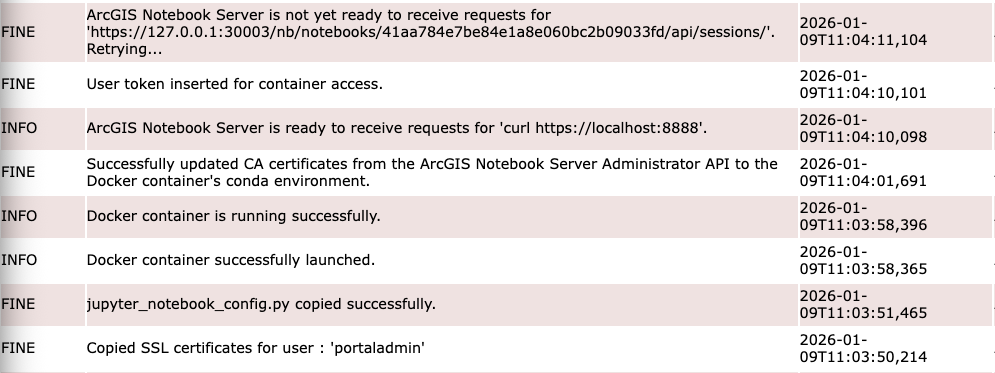

# Install ArcGIS Notebook Server 12.0 (Windows)

!!! note

    These instructions are for installing version 12.0 using Docker Engine (Docker CE).

## Prerequsites

### Enable Windows Containers

- Run the following from an administrator Powershell prompt.

``` powershell
Add-WindowsFeature Containers
```

- Restart the instance.

- Verify containers installation

``` powershell
Get-WindowsFeature Containers
```

### Install Docker Server and Client Binaries

Reference:

- Download latest static binary archive from [Docker Downloads](https://download.docker.com/win/static/stable/x86_64)
- Extract archive to Program Files to install from an administrator Powershell prompt.

``` powershell
Expand-Archive "%USERPROFILE%\Downloads\docker-*.zip" -DestinationPath $Env:ProgramFiles
```

- Register the service

``` powershell
&$Env:ProgramFiles\Docker\dockerd --register-service
```

- Start the Docker Engine

``` powershell
Start-Service docker
```

- Add Docker to the system PATH

``` powershell
$p=[Environment]::GetEnvironmentVariable('Path','Machine');$d="${env:ProgramW6432}\Docker"; if($p -notmatch [Regex]::Escape($d)){[Environment]::SetEnvironmentVariable('Path',($p + (';' + $d)),'Machine')}
```

- Close and reopen an administrative Powershell session to reload the updated PATH varialbe
- Verify Docker installation using `hello-world` image

``` bat
docker run hello-world:nanoserver
```

### Configure Docker Engine

#### Ensure ArcGIS Notebook Server User Account is Administrator

!!! note

    In this example, we are using the `arcgis` user as the ArcGIS Notebook Server user account.

- Start > Computer Management
- Local Users and Groups > Groups
- Double click `docker-users` (if doesn't exist, create)
- Click **Add**. Select `arcgis`, and click **OK** to confirm
- Click **OK** to close group dialog box.
- Create config file at ` C:\ProgramData\docker\config\daemon.json` with following content.

``` json
{
  "group" : "docker-users"
}
```

- Configure your Docker service to listen on a named pipe in an administrator command prompt.

``` powershell
sc.exe config docker binpath= '"C:\Program Files\docker\dockerd.exe" --run-service -H npipe://'
```

!!! note "Removal"

    The docker service can be removed using the following Powershell command.

    ``` powershell
    &"$Env:ProgramFiles\Docker\dockerd" --unregister-service
    ```

- Restart docker

``` bat
net stop docker && net start docker
```

### Ensure Firewall Port 11443 is Open

- Start > Windows System > Control Panel
- System and Security > Windows Defender Firewall > Advanced Settings (on left side)
- Inbound Rules > **New Rule** (top right side)
- Rule Type = **Port**
- Protocol and Ports > Specific Local Ports = **11443**

## Install & Configure Notebook Server

### Install Notebook Server

This step, at least, is pretty straightforward, almost identical to installing any other Esri Enterprise component, so leaving it to the documentation.

Reference: [Install ArcGIS Notebook Server
](https://enterprise.arcgis.com/en/notebook/latest/install/windows/install-arcgis-notebook-server.htm)

### Install the Container Image

Reference: [Configure ArcGIS Notebook Server after installation (Windows containers)](https://enterprise.arcgis.com/en/notebook/latest/install/windows/configure-arcgis-notebook-server-after-installation-windows-containers-.htm)

- Move to the tool directory in an administrator command prompt.

``` bat
cd "C:\Program Files\ArcGIS\NotebookServer\tools\PostInstallUtility"
```

- Ensure container engine is available and correctly configured.

``` bat
PostInstallUtility.bat -d
```

!!! note

    Typically this takes just over 30 minutes to unpack.

- Load the container image.

``` bat
PostInstallUtility.bat -l "%USERPROFILE%\Desktop\ArcGIS_Notebook_Windows_Container_Image_*.tar.gz"
```
 
#### Check Noteook Server Interal Ports

Reference: [Tech Support Case](https://esri.lightning.force.com/lightning/r/Case/500UU00000ICkkjYAD/view)

Verify the ports in the range 30001 to 31000 are not blocked, so Notebook Server can communicate with the Docker container. These ports are essential for the Notebook Server to launch containers and communicate with Jupyter Notebook running in the container. To check if this port range is available, follow the steps below.

??? warning "Warning: Public Network Firewall _Must_ Be Disabled"

    Communication **will not** work between ArcGIS Notebook and the Docker container if the Public Network Firewall is enabled. This must be turned off for this communication to work. 

    
    
    If it is not disabled, the Notebook will load to 60% and then fail.

    
    
    In the logs, the error message will similar to the following.

    

##### Start Notebook Server Manually

On the Notebook Server machine, open the Command Prompt as an Administrator and run the following command to list Docker images.

``` bat
docker images
```

Note the Image ID returned for the image named `arcgis-notebook-python-windows` to use when creating and starting a Notebook Server container using the command below.

``` bat
docker run -it -p 30001:8888 <NOTEBOOK_SERVER_CONTAINER_IMAGEID> jupyter notebook --NotebookApp.ip=0.0.0.0
```

##### Validate Container Communication

If the command in step 2 is successful, open a new Command Prompt as Administrator and run the following command to validate the ports available for communication with the Docker container.

``` bat
docker ps -a
```

Look for an entry in the response that indicates port mapping (e.g., `0.0.0.0:30001->8888/tcp`).
- Test HTTP Response: Open Windows PowerShell as Administrator and run the following command.

``` powershell
wget http://127.0.0.1:30001
```

This should return an HTTP 200 response if the setup is correct. Additionally, you should be able to open up a browser to this same URL and see Jupyer Notebook.

### Set Up Notebook Site

Reference: [Create an ArcGIS Notebook Server site](https://enterprise.arcgis.com/en/notebook/latest/install/windows/create-an-arcgis-notebook-server-site.htm)

!!! note "Opening the Wizard"

    If not open, access wizard from Start > ArcGIS > ArcGIS Notebook Server Configuration Wizard

## Create a Custom Image

References:

- [Build a custom container image](https://enterprise.arcgis.com/en/notebook/latest/install/windows/extend-a-notebook-runtime.htm#ESRI_SECTION1_027D1A1826A242B3BEB7F9A0166DEEEF)
- [ArcGIS Notebooks Python Libraries Manifest](https://www.esri.com/content/dam/esrisites/en-us/media/manuals/arcgis-notebook-runtime/python-library-13.0.pdf)

### Get Python Package Manifest

Reference: [Generate a manifest file for custom and/or extended runtimes](https://support.esri.com/en-us/knowledge-base/generate-manifest-file-for-custom-extended-runtimes-000025575) (Tech Support Article)

``` powershell
$ID = docker container run -d --rm -it -v /:/host <custom_runtime_image_ID>; docker exec -it $ID /opt/conda/bin/conda list --json >> ~\Desktop\manifest.json; docker kill $ID
```
