# Install ArcGIS Web Adapter on Ubuntu with Nginx and Tomcat

Reference: [System Requirements](https://enterprise.arcgis.com/en/web-adaptor/latest/install/java-linux/arcgis-web-adaptor-system-requirements.htm)

## Architecture Overview

This guide implements a **reverse proxy architecture** using **Nginx** as the front-end web server with **Tomcat** as the back-end application server hosting the ArcGIS Web Adapters.

### Architecture Diagram

```mermaid
flowchart LR
    Internet["🌐 Internet<br/>(External Clients)"]
    Nginx["Nginx<br/>Port 443<br/>(SSL/TLS)"]
    Tomcat["Tomcat<br/>Port 8080<br/>(HTTP, localhost only)"]
    WebAdapters["ArcGIS Web Adapters<br/>(Portal & Server)"]
    
    Internet --> |HTTPS| Nginx
    Nginx --> |HTTP<br/>127.0.0.1:8080| Tomcat
    Tomcat --> WebAdapters
    
    style Internet fill:#E8F4F8,stroke:#4A90E2,stroke-width:2px
    style Nginx fill:#7ED321,stroke:#5A9E19,stroke-width:3px,color:#fff
    style Tomcat fill:#F5A623,stroke:#C17F1A,stroke-width:2px,color:#fff
    style WebAdapters fill:#BD10E0,stroke:#8B0BA8,stroke-width:2px,color:#fff
```



This architecture follows security best practices by implementing defense in depth with multiple layers of protection. Requests are received over https on port 443, routed internally to Tomcat on port 8080 (default Tomcat port). Tomcat is running the ArcGIS Web Adapters as applications handing the ArcGIS specific needs for routing traffic to the respective ArcGIS Servers. Each ArcGIS Web Adapter installed has a specifc name such as portal and server, and are accessed at the same URL on different paths. In the aforementioned case of portal and server, this will be `https://webserver.domain.com/portal` and `https://webserver.domain.com/server`.

### Why Use Nginx + Tomcat Instead of Standalone Tomcat?

**Security Benefits:**

- **SSL/TLS Termination**: Nginx handles SSL/TLS encryption/decryption, offloading this resource-intensive task from Tomcat. Nginx is significantly more efficient at SSL/TLS processing than Tomcat due to its optimized C-based implementation and native OpenSSL integration, resulting in lower CPU usage and better performance under high connection loads.
- **Attack Surface Reduction**: Only Nginx is exposed to the internet; Tomcat runs on localhost (127.0.0.1), completely isolated from direct external access. This defense-in-depth architecture means attackers cannot directly exploit Tomcat vulnerabilities, bypass web application firewalls, or probe Tomcat's management interfaces. Even if Nginx is compromised, the attacker still faces the localhost barrier, and any Tomcat-specific attacks must pass through Nginx's filtering and validation layers first.
- **Security Headers**: Nginx easily adds modern security headers (HSTS, CSP, X-Frame-Options, X-Content-Type-Options) with simple configuration directives, whereas implementing these in Tomcat requires complex filter configurations or application-level code changes. This includes HTTP Strict Transport Security to prevent protocol downgrade attacks, Content Security Policy to mitigate XSS attacks, clickjacking protection, and MIME-type sniffing prevention—all centrally managed in one location.
- **DDoS Protection**: Nginx provides built-in rate limiting and connection throttling that can restrict requests per IP address, limit concurrent connections, and enforce request size limits. This prevents resource exhaustion attacks from overwhelming your Tomcat instances by filtering malicious traffic at the network edge before it reaches your application servers.
- **Request Filtering**: Nginx can block malicious requests before they reach Tomcat by validating HTTP methods, filtering suspicious User-Agent strings, blocking known attack patterns (SQL injection, XSS), and implementing geographic restrictions. This significantly reduces the attack surface and computational load on Tomcat.

**Performance Benefits:**

- **Static Content Serving**: Nginx efficiently serves static files (CSS, JavaScript, images) without invoking Tomcat
- **Connection Pooling**: Nginx maintains persistent connections to Tomcat while handling many concurrent client connections
- **Compression**: Nginx handles gzip compression more efficiently than Tomcat
- **Caching**: Nginx can cache responses, reducing load on Tomcat

**Operational Benefits:**

- **Zero-Downtime Deployments**: Update, patch, or restart Tomcat instances without service interruption. Nginx continues serving requests while Tomcat is offline, can gracefully drain connections, and seamlessly redirect traffic during maintenance windows. This enables frequent updates and rapid rollback capabilities without scheduling maintenance windows or notifying users, significantly improving system availability and reducing operational risk during deployments.
- **Load Balancing**: Easily scale horizontally by adding multiple Tomcat instances behind a single Nginx proxy. Nginx distributes requests across backend servers, performs health checks to route traffic only to healthy instances, and automatically removes failed servers from the pool. This enables elastic scaling to handle traffic spikes, improves fault tolerance, and allows capacity planning based on actual demand without architecture changes.
- **Centralized Logging**: All client access logs are consolidated in Nginx (single point of entry), providing complete visibility into all requests, simplified log analysis and monitoring, and consistent log formatting. This eliminates the need to aggregate logs from multiple Tomcat instances, simplifies security auditing and compliance reporting, and makes troubleshooting much easier with a single source of truth for all access patterns.
- **Industry Standard**: Nginx is the de facto standard for reverse proxy deployments worldwide, meaning extensive community support, battle-tested reliability from millions of production deployments, abundant documentation and troubleshooting resources, and widespread expertise among system administrators. This architecture's long-term viability and support is well established as an industry standard.
- **Simplified Certificate Management**: SSL certificates are managed in one location (Nginx configuration) rather than distributed across multiple Tomcat connectors or application servers. This centralization means certificate renewals (including Let's Encrypt automation) only need to happen once, cipher suite and TLS protocol updates are applied uniformly across all services, and there's no need to restart application servers for certificate changes—significantly reducing complexity and eliminating common sources of SSL/TLS configuration errors.

### Why Use ArcGIS Web Adapters Instead of Direct Nginx Proxy?

Esri documents two approaches for exposing ArcGIS Enterprise through HTTPS: **(1) using Web Adapters behind a reverse proxy** (this guide), or **(2) configuring a reverse proxy directly to ArcGIS Server and Portal** (bypassing Web Adapters). Both configurations are supported, but the Web Adapter approach offers significant operational and architectural advantages.

**References:**

- [Using a reverse proxy with Portal for ArcGIS](https://enterprise.arcgis.com/en/portal/latest/administer/linux/using-a-reverse-proxy-server-with-portal-for-arcgis.htm)
- [Using a reverse proxy with ArcGIS Server](https://enterprise.arcgis.com/en/server/latest/administer/linux/using-a-reverse-proxy-server-with-arcgis-server.htm)
- [ArcGIS Web Adaptor](https://enterprise.arcgis.com/en/web-adaptor/latest/install/java-linux/welcome-arcgis-web-adaptor-install-guide.htm)

**Advantages of Web Adapters:**

- **Simplified Configuration**: Web Adapters handle complex URL rewriting and request routing automatically through a configuration wizard (`/webadaptor/config`). Direct proxy configurations require manual mapping of dozens of REST endpoints, WebSocket paths, and context-specific routes that must be maintained across upgrades.

- **Built-in URL Translation**: Web Adapters automatically translate external URLs (`https://server.com/portal`) to internal ArcGIS REST endpoints (`http://internal:7443/arcgis/sharing/rest`) with proper context path handling, query parameter preservation, and response body URL rewriting. This eliminates the need to write and maintain complex proxy rewrite rules.

- **Simplified Web-Tier Authentication**: Web Adapters provide native integration with web-tier authentication mechanisms (IWA, PKI, SAML) through the configuration interface. Setting up web-tier authentication with direct proxy requires manual header configuration, token management, and custom authentication flow implementation.

- **Automatic Configuration Updates**: When ArcGIS components change (upgrades, configuration changes, new services), Web Adapters automatically adjust their routing and URL mapping. Direct proxy configurations require manual review and updates to proxy rules after each change.

- **High Availability Support**: Web Adapters include built-in logic for multi-machine Portal deployments and federated Server sites, handling session affinity, health checks, and failover automatically. Replicating this with raw proxy configuration requires significant custom development.

- **Consistent Support Experience**: Esri's technical support, documentation examples, and troubleshooting guides assume Web Adapter deployment. While direct proxy configurations are documented, the vast majority of support resources, community knowledge, and tested upgrade paths focus on Web Adapter architectures.

- **Configuration Validation**: Web Adapters validate the connection to ArcGIS components during registration, checking certificates, ports, and connectivity before going into production. This catches configuration errors early rather than during production use.

- **Reduced Maintenance Burden**: Web Adapters are maintained and updated by Esri as part of the ArcGIS Enterprise release cycle. Proxy rules must be maintained by administrators and tested with each new ArcGIS release to ensure compatibility with API changes.

**When Direct Proxy Might Be Preferred:**

- You have an existing reverse proxy infrastructure with strict standardization requirements
- You need custom request/response transformations beyond what Web Adapters provide
- You're using a reverse proxy platform that Web Adapters don't support (e.g., cloud-native load balancers)
- You want to completely eliminate the Tomcat/Java dependency from your infrastructure

**Summary**: Both approaches are valid and supported by Esri. This guide uses Web Adapters because they significantly reduce configuration complexity, provide automatic ArcGIS-specific integration, and align with the most common deployment pattern in the ArcGIS community. The combination of **Nginx** (SSL/TLS, security, performance) + **Tomcat** (application server) + **Web Adapters** (ArcGIS integration) delivers a production-ready architecture with minimal ongoing maintenance.

## Update System Packages

Start by updating your package lists and upgrading existing packages to their latest versions if this has not already been done.

``` bash
sudo apt update
sudo apt upgrade -y
```

## Firewall Configuration

If UFW (Uncomplicated Firewall) is enabled on your Ubuntu system, configure it to allow the necessary traffic:

- **Port 22**: SSH access for administration
- **Port 80**: HTTP (will redirect to HTTPS)
- **Port 443**: HTTPS for secure access
- **Port 8080**: Only if you need direct Tomcat access for testing (NOT recommended in production)

``` bash
# Essential ports for production
sudo ufw allow 22/tcp
sudo ufw allow 80/tcp
sudo ufw allow 443/tcp

# Optional: Only allow port 8080 from specific IP for testing
# sudo ufw allow from <your_admin_ip> to any port 8080 proto tcp

sudo ufw enable
```

**Security Note**: In production, Tomcat should ONLY listen on localhost (127.0.0.1), not on the external network interface. This ensures all external traffic must pass through Nginx, providing an additional security layer.

## Service User

Create a user and group named `web-services` that will own and run the Tomcat service.

``` bash
sudo useradd -s /bin/false -m -U web-services
```

## Install and Configure System Requirements

Reference: [ArcGIS Web Adaptor System Requirements](https://enterprise.arcgis.com/en/web-adaptor/latest/install/java-linux/arcgis-web-adaptor-system-requirements.htm)

### Java

- Install

Open your terminal and run the following commands to update your system's package list and install OpenJDK, the default Java development kit for Ubuntu.

``` bash
sudo apt update
sudo apt install openjdk-17-jdk -y
```

Verify the Java installation.

``` bash
java -version
```

### Authbind

**Note**: When using Nginx as the reverse proxy, authbind is **NOT required** for Tomcat because:

- Nginx handles port 443 (HTTPS) and port 80 (HTTP)
- Tomcat only needs to listen on port 8080 (>1024) on localhost

However, if you plan to run Tomcat standalone for testing, you can still install authbind:

``` bash
# Optional - only needed for standalone Tomcat testing
sudo apt install authbind -y
sudo touch /etc/authbind/byport/443
sudo chown web-services:web-services /etc/authbind/byport/443
sudo chmod 500 /etc/authbind/byport/443
```

For production with Nginx, skip this step.

### Tomcat Server

- [Medium: Installing Apache Tomcat on Ubuntu 22.04](https://medium.com/@madhavarajas1997/installing-apache-tomcat-on-ubuntu-22-04-08c8eda52312)

#### Download Apache Tomcat 10.1

Tomcat is not available in the default Ubuntu repositories, so you must download the binary distribution manually. 

1. Navigate to a temporary directory

``` bash
cd /tmp
``` 

2. Visit the official [Apache Tomcat 10 Software Downloads](https://www.google.com/url?sa=i&source=web&rct=j&url=https://tomcat.apache.org/download-10.cgi&ved=2ahUKEwij0qie14mSAxWEmGoFHQRYB84Qy_kOegQIDBAE&opi=89978449&cd&psig=AOvVaw10ehzpfYEwMvNo8KYnvwip&ust=1768433752574000) page to find the latest stable version and get the download link for the `*.tar.gz` file.

3. Use wget to download the package (replace the URL with the current version's link).

``` bash
wget //dlcdn.apache.org/tomcat/tomcat-10/v<version>/bin/apache-tomcat-<version>.tar.gz
```

4. Create the destination directories and extract the archive. We use a FHS-compliant layout:
    - `/opt/tomcat` - Application binaries (read-only)
    - `/etc/opt/tomcat` - Configuration files
    - `/var/opt/tomcat` - Variable data (logs, temp, work, webapps)

``` bash
# Create directory structure
sudo mkdir -p /opt/tomcat
sudo mkdir -p /etc/opt/tomcat
sudo mkdir -p /var/opt/tomcat/{logs,temp,work,webapps}

# Extract Tomcat to /opt/tomcat
sudo tar xvf apache-tomcat-*.tar.gz -C /opt/tomcat --strip-components=1

# Move configuration files to /etc/opt/tomcat
sudo mv /opt/tomcat/conf/* /etc/opt/tomcat/
sudo rmdir /opt/tomcat/conf
sudo ln -s /etc/opt/tomcat /opt/tomcat/conf

# Move variable directories to /var/opt/tomcat and create symlinks
sudo rm -rf /opt/tomcat/logs /opt/tomcat/temp /opt/tomcat/work /opt/tomcat/webapps
sudo ln -s /var/opt/tomcat/logs /opt/tomcat/logs
sudo ln -s /var/opt/tomcat/temp /opt/tomcat/temp
sudo ln -s /var/opt/tomcat/work /opt/tomcat/work
sudo ln -s /var/opt/tomcat/webapps /opt/tomcat/webapps

# Copy default webapps to new location
sudo tar xvf apache-tomcat-*.tar.gz -C /tmp --strip-components=1 apache-tomcat-*/webapps
# Remove existing webapps to allow clean re-installation
sudo rm -rf /var/opt/tomcat/webapps/*
sudo mv /tmp/webapps/* /var/opt/tomcat/webapps/
sudo rm -rf /tmp/webapps
```

#### Configure Permissions

Set ownership and permissions for each directory according to its purpose:

- `/opt/tomcat` - Owned by root, readable by web-services (binaries should be read-only)
- `/etc/opt/tomcat` - Owned by root, readable by web-services (config files)
- `/var/opt/tomcat` - Owned by web-services (writable for logs, temp files, etc.)

``` bash
# Binary directory - root owns, web-services can read/execute
sudo chown -R root:web-services /opt/tomcat/
sudo chmod -R 750 /opt/tomcat/
sudo chmod -R u+x /opt/tomcat/bin

# Configuration directory - root owns, web-services can read
sudo chown -R root:web-services /etc/opt/tomcat/
sudo chmod -R 750 /etc/opt/tomcat/

# Variable data directory - web-services owns (needs write access)
sudo chown -R web-services:web-services /var/opt/tomcat/
sudo chmod -R 750 /var/opt/tomcat/
```

#### Service Configuration

##### Create Systemd Unit File

To run Tomcat as a service that can be started and stopped easily, create a systemd unit file.

**Important**: When using Nginx as a reverse proxy, configure Tomcat to listen **only on localhost** for security.

1. Create the service file using a text editor (like `nano`)

    ``` bash
    sudo nano /etc/systemd/system/tomcat.service
    ```

2. Populate the configuration file with the following.

    ``` ini
    [Unit]
    Description="Apache Tomcat Web Application Server"
    After=network.target

    [Service]
    Type=forking

    # although the service is started as root, it runs as the web-services user
    User=web-services
    Group=web-services

    # environment variables, where to find Java and Tomcat
    Environment="JAVA_HOME=/usr/lib/jvm/java-17-openjdk-amd64"
    Environment="CATALINA_HOME=/opt/tomcat"
    Environment="CATALINA_BASE=/opt/tomcat"
    Environment="CATALINA_PID=/var/opt/tomcat/temp/tomcat.pid"
    Environment="CATALINA_TMPDIR=/var/opt/tomcat/temp"
    # Bind only to localhost when using Nginx proxy
    Environment="CATALINA_OPTS=-Djava.awt.headless=true -Dorg.apache.catalina.connector.RECYCLE_FACADES=true"

    # Startup command (no authbind needed when listening on port 8080)
    ExecStart=/opt/tomcat/bin/startup.sh
    ExecStop=/opt/tomcat/bin/shutdown.sh

    RestartSec=10
    Restart=always

    [Install]
    WantedBy=multi-user.target
    ```

**Key Changes for Nginx Architecture:**

- Removed `authbind` from `ExecStart` (not needed for port 8080)
- Added security-focused `CATALINA_OPTS`
- Tomcat will listen on localhost:8080 (configured in server.xml below)

##### Start and Enable the Tomcat Service

Reload systemd to recognize the new service and start Tomcat.

``` bash
sudo systemctl daemon-reload
sudo systemctl start tomcat
sudo systemctl enable tomcat
```

Check the status of the service to ensure it is running correctly.

``` bash
sudo systemctl status tomcat
```

**Verify Tomcat is listening on port 8080:**

``` bash
sudo ss -tlnp | grep 8080
```

You should see Tomcat listening on `127.0.0.1:8080` (localhost only). You can test locally:

``` bash
curl http://localhost:8080
```

**Important**: At this stage, Tomcat is NOT accessible from external networks, which is the desired security posture. External access will be provided through Nginx.

#### Configure Tomcat Server for HTTP (Behind Nginx)

When using Nginx as a reverse proxy, Tomcat configuration is simplified:

1. **Tomcat handles HTTP only** (no SSL/TLS configuration needed)
2. **Listens on localhost:8080** only
3. **Nginx handles all SSL/TLS termination**

Open the Tomcat `server.xml` configuration file:

``` bash
sudo nano /etc/opt/tomcat/server.xml
```

**Modify the HTTP Connector** to listen only on localhost and enable proxy headers:

Find the existing `<Connector port="8080"` element and replace it with:

``` xml
    <!-- HTTP Connector - localhost only, behind Nginx reverse proxy -->
    <Connector port="8080"
               protocol="HTTP/1.1"
               address="127.0.0.1"
               connectionTimeout="20000"
               redirectPort="8443"
               maxThreads="300"
               maxParameterCount="1000"
               URIEncoding="UTF-8" />
```

**Configure Remote IP Valve** for proper client IP logging. Add this within the `<Host>` element:

``` xml
    <Valve className="org.apache.catalina.valves.RemoteIpValve"
           remoteIpHeader="x-forwarded-for"
           proxiesHeader="x-forwarded-by"
           protocolHeader="x-forwarded-proto" />
```

**Remove or comment out any SSL/TLS connectors** on port 443 or 8443, as Nginx will handle SSL:

``` xml
    <!-- 
    SSL/TLS is handled by Nginx - no direct HTTPS connector needed
    <Connector port="443" ... />
    -->
```

Save and restart Tomcat:

``` bash
sudo systemctl restart tomcat
```

---

## Install and Configure Nginx

Nginx will serve as the secure front-end web server, handling SSL/TLS termination and proxying requests to Tomcat.

### Install Nginx

``` bash
sudo apt update
sudo apt install nginx -y
```

### Create SSL Certificate Directory

Create a directory to store SSL/TLS certificates:

``` bash
sudo mkdir -p /etc/nginx/ssl
sudo chown root:root /etc/nginx/ssl
sudo chmod 700 /etc/nginx/ssl
```

### Obtain SSL/TLS Certificates

You need SSL/TLS certificates for your domain. Choose one of the following options:

#### Option 1: Esri Internal Certificates

??? note "Esri Internal Certificates"

    For machines on the Esri internal network, you can get certificates for your machine name (`servername.esri.com`) from [https://certifactory.esri.com/certs/](https://certifactory.esri.com/certs/).

    **1. Trust Esri Internal PKI:**

    ``` bash
    sudo curl -L http://certifactory.esri.com/certs/esriroot.crt --output /usr/local/share/ca-certificates/esri_root_ca.crt
    sudo curl -L http://certifactory.esri.com/certs/caroot.crt --output /usr/local/share/ca-certificates/esri_issuing_ca.crt
    sudo update-ca-certificates
    ```

    **2. Download Certificates:**

    ``` bash
    # Download server PFX (replace servername and password)
    curl -o /tmp/server.pfx "https://certifactory.esri.com/api/servername.pfx?password=P@\$\$w0rd"
    
    # Download intermediate certificate
    curl -o /tmp/esri_intermediate.crt http://esri_pki.esri.com/crl/Esri%20Issuing%20CA.crt
    
    # Download root certificate
    curl -o /tmp/caroot.crt https://certifactory.esri.com/api/caroot.crt
    ```

    **3. Convert PFX to PEM format for Nginx:**

    ``` bash
    # Extract certificate and private key from PFX
    openssl pkcs12 -in /tmp/server.pfx -clcerts -nokeys -out /tmp/server.crt -passin pass:'P@$$w0rd'
    openssl pkcs12 -in /tmp/server.pfx -nocerts -nodes -out /tmp/server.key -passin pass:'P@$$w0rd'
    
    # Convert intermediate and root certificates to PEM
    openssl x509 -inform DER -in /tmp/esri_intermediate.crt -out /tmp/esri_intermediate.pem 2>/dev/null || cp /tmp/esri_intermediate.crt /tmp/esri_intermediate.pem
    openssl x509 -inform DER -in /tmp/caroot.crt -out /tmp/esri_root.pem 2>/dev/null || cp /tmp/caroot.crt /tmp/esri_root.pem
    
    # Create full certificate chain
    cat /tmp/server.crt /tmp/esri_intermediate.pem /tmp/esri_root.pem > /tmp/fullchain.crt
    
    # Move to Nginx SSL directory
    sudo mv /tmp/fullchain.crt /etc/nginx/ssl/server.crt
    sudo mv /tmp/server.key /etc/nginx/ssl/server.key
    sudo chmod 600 /etc/nginx/ssl/server.key
    sudo chmod 644 /etc/nginx/ssl/server.crt
    
    # Clean up temporary files
    rm -f /tmp/server.* /tmp/esri_* /tmp/caroot.*
    ```

#### Option 2: Let's Encrypt Certificates

For public-facing servers, use Let's Encrypt with Certbot:

``` bash
sudo apt install certbot python3-certbot-nginx -y
sudo certbot --nginx -d your-domain.com
```

Certbot will automatically configure Nginx with SSL certificates and set up auto-renewal.

#### Option 3: Commercial or Self-Signed Certificates

Place your certificate and private key in `/etc/nginx/ssl/`:

- Certificate (with chain): `/etc/nginx/ssl/server.crt`
- Private key: `/etc/nginx/ssl/server.key`

### Configure Nginx as Reverse Proxy

Create a new Nginx configuration file for ArcGIS Enterprise:

``` bash
sudo nano /etc/nginx/sites-available/arcgis-enterprise
```

Add the following configuration with security best practices:

!!! note "Rate Limits for Web Mapping Applications"

    **Important**: The default rate limits shown below are conservative starting points. Web mapping applications like ArcGIS generate **significantly more requests** than typical web applications due to:
    
    - **Map tile loading**: A single map view can trigger 20-50+ simultaneous tile requests
    - **Feature layer queries**: Multiple feature layers loading concurrently
    - **Real-time updates**: Dynamic layers that refresh frequently
    - **User interactions**: Pan, zoom, identify operations generating rapid requests
    
    **Recommended Rate Limits for ArcGIS**:
    - `rate=50r/s` to `rate=100r/s` for general use (instead of the conservative 10r/s shown)
    - `burst=100` to `burst=200` to handle map load spikes
    - `limit_conn` of 20-50 concurrent connections per IP
    
    Monitor your `/var/log/nginx/arcgis-error.log` for "limiting requests" messages and adjust accordingly. Consider exempting internal/trusted IPs from rate limiting if needed.

``` nginx
# Rate limiting zone - prevents DDoS attacks
limit_req_zone $binary_remote_addr zone=arcgis_limit:10m rate=10r/s;
limit_conn_zone $binary_remote_addr zone=conn_limit:10m;

# Upstream definition for Tomcat
upstream tomcat_backend {
    server 127.0.0.1:8080 fail_timeout=30s max_fails=3;
    keepalive 32;
}

# HTTP Server - redirect all traffic to HTTPS
server {
    listen 80;
    listen [::]:80;
    server_name your-server.esri.com;  # Replace with your actual hostname
    
    # Allow Let's Encrypt ACME challenge
    location /.well-known/acme-challenge/ {
        root /var/www/html;
    }
    
    # Redirect all other HTTP traffic to HTTPS
    location / {
        return 301 https://$server_name$request_uri;
    }
}

# HTTPS Server - main configuration
server {
    listen 443 ssl http2;
    listen [::]:443 ssl http2;
    server_name your-server.esri.com;  # Replace with your actual hostname
    
    # SSL/TLS Configuration
    ssl_certificate /etc/nginx/ssl/server.crt;
    ssl_certificate_key /etc/nginx/ssl/server.key;
    
    # Modern SSL/TLS configuration (Mozilla Intermediate profile)
    ssl_protocols TLSv1.2 TLSv1.3;
    ssl_ciphers 'ECDHE-ECDSA-AES128-GCM-SHA256:ECDHE-RSA-AES128-GCM-SHA256:ECDHE-ECDSA-AES256-GCM-SHA384:ECDHE-RSA-AES256-GCM-SHA384:ECDHE-ECDSA-CHACHA20-POLY1305:ECDHE-RSA-CHACHA20-POLY1305:DHE-RSA-AES128-GCM-SHA256:DHE-RSA-AES256-GCM-SHA384';
    ssl_prefer_server_ciphers off;
    
    # SSL session configuration
    ssl_session_cache shared:SSL:10m;
    ssl_session_timeout 10m;
    ssl_session_tickets off;
    
    # OCSP Stapling
    ssl_stapling on;
    ssl_stapling_verify on;
    resolver 8.8.8.8 8.8.4.4 valid=300s;
    resolver_timeout 5s;
    
    # Security Headers
    add_header Strict-Transport-Security "max-age=63072000; includeSubDomains; preload" always;
    add_header X-Frame-Options "SAMEORIGIN" always;
    add_header X-Content-Type-Options "nosniff" always;
    add_header X-XSS-Protection "1; mode=block" always;
    add_header Referrer-Policy "strict-origin-when-cross-origin" always;
    
    # Logging
    access_log /var/log/nginx/arcgis-access.log;
    error_log /var/log/nginx/arcgis-error.log warn;
    
    # Client upload limits (adjust based on your needs)
    client_max_body_size 100M;
    client_body_buffer_size 128k;
    
    # Timeouts
    proxy_connect_timeout 300s;
    proxy_send_timeout 300s;
    proxy_read_timeout 300s;
    send_timeout 300s;
    
    # Apply rate limiting
    limit_req zone=arcgis_limit burst=20 nodelay;
    limit_conn conn_limit 10;
    
    # Root location - proxy to Tomcat
    location / {
        proxy_pass http://tomcat_backend;
        proxy_http_version 1.1;
        
        # Proxy headers - preserve original request information
        proxy_set_header Host $host;
        proxy_set_header X-Real-IP $remote_addr;
        proxy_set_header X-Forwarded-For $proxy_add_x_forwarded_for;
        proxy_set_header X-Forwarded-Proto $scheme;
        proxy_set_header X-Forwarded-Host $host;
        proxy_set_header X-Forwarded-Port $server_port;
        
        # WebSocket support (required for some ArcGIS Enterprise features)
        proxy_set_header Upgrade $http_upgrade;
        proxy_set_header Connection "upgrade";
        
        # Buffering configuration
        proxy_buffering on;
        proxy_buffer_size 4k;
        proxy_buffers 8 4k;
        proxy_busy_buffers_size 8k;
        
        # Connection reuse
        proxy_set_header Connection "";
    }
    
    # Optional: Serve static content directly from Nginx for better performance
    location ~* \.(jpg|jpeg|png|gif|ico|css|js|svg|woff|woff2|ttf|eot)$ {
        proxy_pass http://tomcat_backend;
        expires 30d;
        add_header Cache-Control "public, immutable";
    }
    
    # Health check endpoint
    location /health {
        access_log off;
        return 200 "OK\n";
        add_header Content-Type text/plain;
    }
}
```

**Key Configuration Explanations:**

- **Rate Limiting**: Prevents DDoS attacks by limiting requests per IP address
- **HTTP to HTTPS Redirect**: Ensures all traffic is encrypted
- **Modern SSL/TLS**: Uses only TLS 1.2 and 1.3 with strong cipher suites
- **Security Headers**: Implements HSTS, frame protection, and XSS protection
- **Proxy Headers**: Preserves original client information for Tomcat logging
- **WebSocket Support**: Required for real-time ArcGIS features
- **Connection Pooling**: Keepalive connections to Tomcat for better performance

### Enable and Start Nginx

Enable the site configuration and test:

``` bash
# Create symbolic link to enable site
sudo ln -s /etc/nginx/sites-available/arcgis-enterprise /etc/nginx/sites-enabled/

# Remove default site (optional)
sudo rm -f /etc/nginx/sites-enabled/default

# Test Nginx configuration
sudo nginx -t

# If test passes, restart Nginx
sudo systemctl restart nginx
sudo systemctl enable nginx
```

### Verify the Setup

Check that Nginx is running and listening on ports 80 and 443:

``` bash
sudo systemctl status nginx
sudo ss -tlnp | grep nginx
```

Test access from your browser:

- `http://your-server.esri.com` → should redirect to HTTPS
- `https://your-server.esri.com` → should show Tomcat landing page through Nginx


### Security Hardening (Optional but Recommended)

#### Enable UFW Application Profile

``` bash
sudo ufw app list
sudo ufw allow 'Nginx Full'
sudo ufw delete allow 8080/tcp  # Remove direct Tomcat access if previously allowed
```

#### Disable Nginx Version in Headers

Edit `/etc/nginx/nginx.conf` and add:

``` nginx
http {
    server_tokens off;
    # ... other directives
}
```

#### Configure Fail2Ban for Additional Protection

[Fail2Ban](https://github.com/fail2ban/fail2ban) is an intrusion prevention framework that monitors log files for malicious activity (such as repeated failed login attempts, vulnerability scans, or suspicious request patterns) and automatically bans IP addresses by updating firewall rules. It provides an additional layer of defense against brute-force attacks, automated scanning tools, and common web exploits by temporarily or permanently blocking attackers after a configurable number of violations.

**Why Fail2Ban is recommended for this deployment:**

- Automatically blocks IPs making repeated authentication attempts against Tomcat Manager or Nginx
- Protects against vulnerability scanners probing for known exploits
- Reduces server load by blocking malicious bots and DDoS attempts at the firewall level
- Works seamlessly with UFW and iptables to enforce bans
- Minimal resource overhead with built-in filters for common attack patterns

**Reference**: [Fail2Ban Documentation](https://fail2ban.readthedocs.io/)

``` bash
sudo apt install fail2ban -y
sudo nano /etc/fail2ban/jail.local
```

Add:

``` ini
[nginx-http-auth]
enabled = true

[nginx-noscript]
enabled = true

[nginx-badbots]
enabled = true

[nginx-noproxy]
enabled = true
```

!!! note "Fail2Ban and ArcGIS Traffic Compatibility"

    These Fail2Ban jails are safe for ArcGIS Enterprise deployments:
    
    - **nginx-badbots**: Blocks known malicious user agents (scanners, exploits). Legitimate ArcGIS clients (web apps, mobile apps, ArcGIS Pro) use standard user agents and are not affected.
    - **nginx-noproxy**: Prevents open proxy abuse. Does not interfere with legitimate cross-domain requests (CORS) for basemaps or ArcGIS services.
    - **nginx-http-auth**: Blocks repeated authentication failures. Won't affect normal ArcGIS authentication patterns.
    - **nginx-noscript**: Blocks attempts to execute scripts in non-script directories.
    
    **Important distinctions:**
    
    - **Fail2Ban** detects *malicious patterns* (failed logins, vulnerability scans, attack signatures) and bans IPs temporarily
    - **Nginx rate limiting** (configured above) controls *request volume* per IP and may need adjustment for map tile loading
    
    **Best practices:**
    
    - Monitor Fail2Ban logs: `sudo tail -f /var/log/fail2ban.log`
    - Review banned IPs: `sudo fail2ban-client status nginx-http-auth`
    - Whitelist trusted internal IPs in `/etc/fail2ban/jail.local` if needed:
        ```ini
        [DEFAULT]
        ignoreip = 127.0.0.1/8 ::1 10.0.0.0/8 192.168.0.0/16
        ```

Restart Fail2Ban:

``` bash
sudo systemctl restart fail2ban
```

---

---

## Enable Remote Access to Tomcat Manager (Optional)

If you need to access the Tomcat Manager web interface for administration, configure remote access. This is optional and primarily used for troubleshooting.

**Security Warning**: The Tomcat Manager should NOT be exposed through Nginx in production. Access it only via SSH tunnel or from localhost.

### Configure via SSH Tunnel (Recommended)

### Configure via SSH Tunnel (Recommended)

Create an SSH tunnel from your local machine:

``` bash
ssh -L 8080:localhost:8080 user@your-server.esri.com
```

Then access `http://localhost:8080/manager/html` on your local machine.

### Configure for Direct Access (Not Recommended for Production)

If you must allow direct access to Tomcat Manager:

1. Edit the context files for Manager and Host Manager:

``` bash
sudo nano /var/opt/tomcat/webapps/manager/META-INF/context.xml
sudo nano /var/opt/tomcat/webapps/host-manager/META-INF/context.xml
```

2. In each file, comment out the `<Valve>` element:

``` xml
<Valve className="org.apache.catalina.valves.RemoteAddrValve"
    allow="127\.\d+\.\d+\.\d+|::1|0:1"/>
```

Enclose this line in comment tags, like so:

``` xml
<!--
<Valve className="org.apache.catalina.valves.RemoteAddrValve"
    allow="127\.\d+\.\d+\.\d+|::1|0:1"/>
-->
```

3. Configure admin credentials in `tomcat-users.xml`:

``` bash
sudo nano /etc/opt/tomcat/tomcat-users.xml
```

4. Add admin user (replace credentials with secure values):

``` xml
<role rolename="manager-gui"/>
<role rolename="admin-gui"/>
<user username="admin" password="strong-password-here" roles="manager-gui,admin-gui"/>
```

5. Restart Tomcat:

``` bash
sudo systemctl restart tomcat
```

**Access URLs**:

- Manager App: `http://localhost:8080/manager/html` (via SSH tunnel)
- Host Manager App: `http://localhost:8080/host-manager/html` (via SSH tunnel)

**Note**: Tomcat Manager should NOT be accessible through Nginx/HTTPS. Keep it localhost-only for security.

---

## Install Web Adapter

Reference: [ArcGIS Web Adaptor Installation Guide](https://enterprise.arcgis.com/en/web-adaptor/latest/install/java-linux/welcome-arcgis-web-adaptor-install-guide.htm)

Procure the installation files for the ArcGIS Web Adapter for Linux from the Esri software repository or download them from the Esri customer care website. Place the file in `/tmp`.

``` bash
cp /mnt/software/120_Final/Web_Adapter_for_ArcGIS_Linux_*.tar.gz /tmp
# Or for newer naming convention:
cp /mnt/software/120_Final/ArcGIS_Web_Adaptor_*_Linux_*.tar.gz /tmp
```

### Unpack the Installer

Unpack the installer tarball. This works with multiple file naming conventions.

``` bash
# Clean up any existing extraction
rm -rf /tmp/WebAdapter*

# Extract the tarball
tar xvf /tmp/*Web*Adaptor*Linux*.tar.gz -C /tmp
```

### Create the Installation Directory

Create the parent installation directory for ArcGIS products with proper ownership.

``` bash
sudo mkdir -p /opt/arcgis
sudo chown web-services:web-services /opt/arcgis
sudo chmod 750 /opt/arcgis
```

### Run the Installer

Run the setup script as the `web-services` user. The Setup file location may vary depending on the tarball structure.

!!! note "`web-services` User"

    The ArcGIS Web Adaptor for Java requires a Java application server to run, and will be copied from this location to the Tomcat web applications directory. In this installation, we are using Apache Tomcat, which we have configured to run under the `web-services` user. Therefore, we install the Web Adaptor as the `web-services` user to ensure proper permissions and integration with the Tomcat server when deploying the Web Adaptor application to Tomcat.

``` bash
# Find and make Setup executable
SETUP_FILE=$(find /tmp -maxdepth 2 -name "Setup" -type f 2>/dev/null | grep -i webadaptor | head -1)
chmod +x "$SETUP_FILE"

# Run installer
sudo -u web-services "$SETUP_FILE" -m silent -l yes -d /opt/arcgis -v
```

The installer places the Web Adapter files in a versioned directory (e.g., `/opt/arcgis/webadaptor12.0` for version 12.0). Create a symlink to make the installation directory consistent:

``` bash
# Find the installed directory
WEBADAPTOR_DIR=$(find /opt/arcgis -maxdepth 1 -type d -iname "webadaptor*" 2>/dev/null | head -1)

# Create symlink
if [[ -n "$WEBADAPTOR_DIR" ]]; then
    sudo rm -rf /opt/arcgis/webadaptor
    sudo ln -sf "$WEBADAPTOR_DIR" /opt/arcgis/webadaptor
    echo "Created symlink: /opt/arcgis/webadaptor -> $WEBADAPTOR_DIR"
fi

# Clean up
rm -rf /tmp/WebAdapter*
```

Once installed, the web adapter can be configured to support specific ArcGIS Enterprise components (Portal for ArcGIS and ArcGIS Server) following installation as part of the configuration process for the necessary components.

## Install Portal and Server Web Adapters

Although we cannot configure them until the respective components are installed, we can install both the Portal for ArcGIS Web Adaptor and the ArcGIS Server Web Adaptor now. All we need to do is deploy the respective WAR files to the Tomcat web applications directory, and restart Tomcat.

``` bash
# Deploy Portal and Server Web Adaptor WAR files
sudo mkdir -p /var/opt/tomcat/webapps/portal
sudo mkdir -p /var/opt/tomcat/webapps/server
sudo cp /opt/arcgis/webadaptor/portal/war/arcgis.war /var/opt/tomcat/webapps/portal.war
sudo cp /opt/arcgis/webadaptor/server/war/arcgis.war /var/opt/tomcat/webapps/server.war

# Set proper ownership
sudo chown -R web-services:web-services /var/opt/tomcat/webapps/

# Restart Tomcat
sudo systemctl restart tomcat
```

!!! warning "Do Not Configure Web Adapters Yet"

    Do not attempt to configure the Web Adapters for Portal for ArcGIS or ArcGIS Server until those components are installed and running. The Web Adapter configuration process requires communication with the respective component, which will fail if the component is not yet installed. Attempting to configure the Web Adapters before installing Portal for ArcGIS and ArcGIS Server will result in errors and unsuccessful configuration.

## Conclusion

You have successfully configured a secure ArcGIS Web Adapter deployment using:

- **Nginx** as the front-end reverse proxy handling SSL/TLS termination and security
- **Tomcat** as the back-end application server hosting the ArcGIS Web Adapters
- **Defense in depth** security architecture with multiple protection layers

### What's Next

1. **Install Portal for ArcGIS and ArcGIS Server** - Follow the respective installation guides
2. **Configure Web Adapters** - Once Portal and Server are running, configure the Web Adapters at:

    - Portal: `https://your-server.esri.com/arcgis/portal`
    - Server: `https://your-server.esri.com/arcgis/server`
3. **Monitor and Maintain**:

    - Review Nginx access logs: `/var/log/nginx/arcgis-access.log`
    - Review Tomcat logs: `/var/opt/tomcat/logs/catalina.out`
    - Keep SSL certificates up to date
    - Apply security updates regularly

### Advantages of This Architecture

✅ **Enhanced Security**: SSL/TLS managed centrally, Tomcat isolated from direct internet access  
✅ **Better Performance**: Static content served efficiently, connection pooling optimized  
✅ **Simplified Management**: Single point for SSL certificates and security policies  
✅ **Production Ready**: Industry-standard architecture used by major enterprises  
✅ **Scalable**: Easy to add load balancing and multiple Tomcat instances  

### Troubleshooting

**Problem**: Can't access site through HTTPS

- Check Nginx status: `sudo systemctl status nginx`
- Check SSL certificate paths in Nginx config
- Review error logs: `sudo tail -f /var/log/nginx/arcgis-error.log`

**Problem**: 502 Bad Gateway error

- Verify Tomcat is running: `sudo systemctl status tomcat`
- Check Tomcat is listening on localhost:8080: `sudo ss -tlnp | grep 8080`
- Review Tomcat logs: `sudo tail -f /var/opt/tomcat/logs/catalina.out`

**Problem**: Web Adapter not responding

- Confirm WAR files deployed: `ls -la /var/opt/tomcat/webapps/`
- Check for errors in Tomcat logs
- Verify Nginx is forwarding requests correctly
