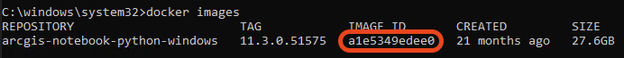
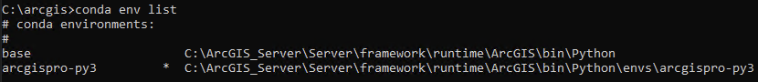
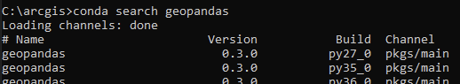
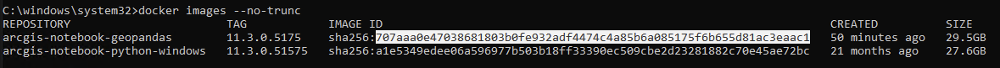
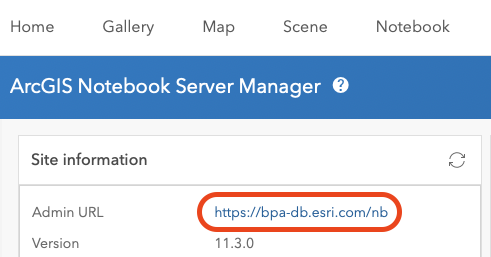
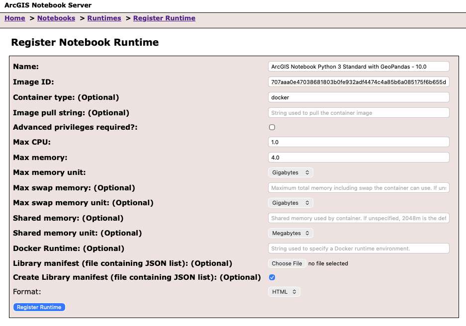
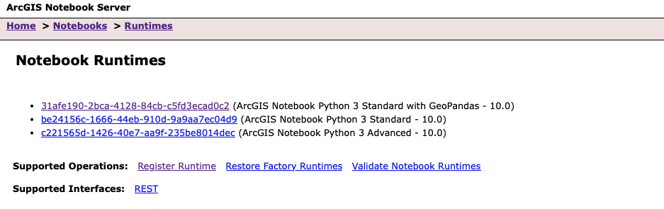
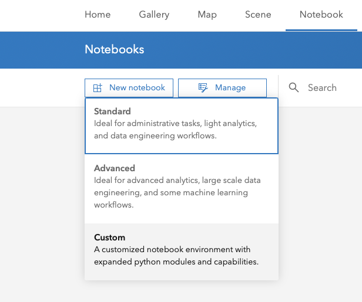
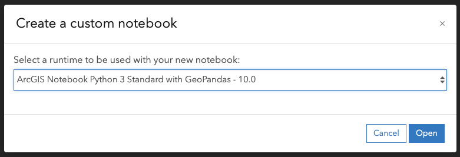

---
tags:
  - ArcGIS Notebook Server
  - Docker
  - Container Images
  - Custom Runtime
  - Conda
  - Jupyter
  - Enterprise
  - Python
  - Package Management
  - Dockerfile
categories:
  - ArcGIS Enterprise Installation
  - Configuration
keywords:
  - custom notebook image
  - docker build
  - conda install
  - jupyter notebook
  - arcgispro-py3
  - container runtime
  - dockerfile
  - docker images
  - package dependencies
  - geopandas
---

# Create Custom Notebook Container Image

Reference: [Build a custom container image](https://enterprise.arcgis.com/en/notebook/latest/install/windows/extend-a-notebook-runtime.htm#ESRI_SECTION1_027D1A1826A242B3BEB7F9A0166DEEEF)

## Develop the Image

Installing additional packages has the potential to break dependencies. I have encountered this when Jupyter packages may inadvertantly be updated to something incompatible with the ArcGIS Notebook Server scripts.

!!! note "Conda Channels"

    The channels used by the Notebook Server are `esri` and `defaults` in that order. Although you can install packages from `conda-forge`, this has a high probablity of breaking the environment, especially if the package you are installing has something in the dependency chain affecting one of the Jupyter packages.

### Launch Container in Interactive Mode

Begin by launching a container using the image downloaded and installed from Esri. This requires first getting the image ID, and then launching this container in interactive mode.

``` bat
docker images
```



Using the image ID collected above, use this image id to launch a Docker container using this image for testing.

``` bat
docker run -ip -p 8888:8888 <IMAGE_ID>
```


This will launch you into an interactive command prompt inside the running docker container.

!!! note Conda Environment

    The default environment `arcgispro-py3` is active in this interactive shell. If you are curious, or want confirmation, you can list the environments and see what the active environment is.

    ``` bat
    conda env list
    ```

    

    The active enviroment, in this case `arcgispro-py3`, has an asterix (`*`) next to it.

### Install Additional Packages

#### Search

First, determine if the package you are interested in is available in the channels `esri` and `defaults` by searching using the following command. While not necessary, this makes installation a lot easier. Also, if you are looking for specific functionality available in a release of the package, this enables you to know if the release you are interested in is available.

``` bat
docker search <PACKAGE>
```



#### Install

If the package is available, you can install the package using Conda.

```bat
conda install <PACKAGE>
```

If you are interested in ensuring a specific version is installed, instead of simply the most current, you can specify the version using the following syntax.

```bat
conda install <PACKAGE>=<VERSION>
```

For instance, if wanting to install GeoPandas 1.1.1, use the following.

```bat
conda install geopandas=1.1.1
```

!!! note

    If having issues with Jupyter getting broken by installing additional packages, it may help to try enforcing strict channel priority. Before doing any installs, run the following command.

    ``` bat
    conda config --env --set channel_priority strict
    ```

    This will force Conda to always prioritize the Esri channel. Typically this makes solving dependencies take _significantly_ longer, but also has yeilded somewhat better results when Jupyter gets broken due to dependencies installed with the additional packages.

### Test Jupyter Notebook

After installing the packages you are interested in, see if Jupyter Notebook launches without errors. The simpliest command is the following.

```bat
jupyter notebook
```

However, if you want to see if you can access the image from the host operating system. This makes it easy to use the hyperlink output to the console to test reaching the notebook from a browser to test if it is possible to access Jupyter from the hosting operating system.

``` bat
jupyter notebook --NotebookApp.ip=0.0.0.0
```

When I was attempting to build an image with GeoPandas, unbeknownst to me, GeoPandas has a Jupyter dependency buried somewhere breaking Jupyter Notebook. A bit of searching and troubleshooting led to the solution of installing (`conda install jupyter`) after installing GeoPandas. Although I cannot completely explain why this works, it does emphasize how useful this interactive environment is for figuring out the right steps for creating a working container.

!!! warning "Containers are Ephemeral"

    Containers are completely ephemeral. Hence, when you are done with the container, you can type `exit` on the command line, and you will be returned to the command prompt in the host operating system. The container, and all the steps you have taken above, will be destroyed. 
    
    For this reason, take note of your steps to include in the Dockerfile. I copy and paste from the command window to the Dockerfile as I'm experimenting.

    This also means, if you need to start over, all you have to do is `exit` and `docker run` to be in a fresh new container to try again.

## Build the Custom Image

### Get ImageID

From a administrator command prompt on the ArcGIS Notebook Server instance, use the following command to get the container image identifier to use in the next step.

``` bat
docker images
```


### Create Dockerfile

Create a custom `DOCKERFILE` following a similar template as below.

!!! note

    This file should be in a new empty directory. This will make the subsequent steps _much_ easier.

``` dockerfile
# starting point for new notebook image, the base arcgis-notebook-python-windows image
# this is discovered by typing `docker images` in an administrator command prompt
FROM arcgis-notebook-python-windows:11.3.0.51575

# use run to install and clean to reduce image size - using geopandas installed from conda-forge as an example
RUN conda install geopandas -y \
    && conda install jupyter -y \
    && conda clean
```

### Build the Container Image

Build the container image by running the following command from an administrator command prompt.

!!! note

    The structure of the command is the new name (technically the repository) and tag (in this case, version number). Since this new image built using the above dockerfile adds GeoPandas, I am giving it a representative new name, and matching the version number so it is easy to understand this modified container is the same version as the other.

``` bat
docker build -t great-expectations:11.3.0.51575 -f DOCKERFILE .
```

Once finished, if successful, you should see a message indicating the successful build of the image such as `Successfully built <imageID>`.

!!! note

    This step also installs the newly built image locally. Unless you have a multi-machine Notebook Server deployment, you can immediately register the image in ArcGIS Portal.

Finally, get the full ImageID for the newly built container image using the following command.

``` bat
docker images --no-trunc
```

This will provide a list of images installed on the instance with the full image ID. Copy this full image ID to use in the next step, registering the image with ArcGIS Portal.



## Register New Runtime in Notebook Server Manager 

### Get the Python Package Manifest

Reference: [Generate a manifest file for custom and/or extended runtimes](https://support.esri.com/en-us/knowledge-base/generate-manifest-file-for-custom-extended-runtimes-000025575) (Tech Support Article)

Use the following command to get the Python Package manifest, the list of packages installed in the new custom image. Replace the image Id and the directory path with the path to the directory you created for the Dockerfile.

``` powershell
$ID = docker run -d -it <IMAGE_ID> cmd; docker exec -it $ID powershell "conda list --json >> C:\arcgis\home\manifest.json"; docker cp $ID/:C:\arcgis\home\manifest.json <DIRECTORY_PATH>; docker kill $ID; docker rm -f $ID;
```

For instance, below I copied the _full_ image id and am outputting the manifest file to my project directory, `C:\Users\joel5174\custom-image-geopandas`.

``` powershell
$ID = docker run -d -it 707aaa0e47038681803b0fe932adf4474c4a85b6a085175f6b655d81ac3eaac1 cmd; docker exec -it $ID powershell "conda list --json >> C:\arcgis\home\manifest.json"; docker cp $ID/:C:\arcgis\home\manifest.json C:\Users\joel5174\custom-image-geopandas; docker kill $ID; docker rm -f $ID;
```

After exporting, you must edit the manifest, or it _will not_ load in the step below.

## Install the Image in Notebook Server

Reference: [Register a New Runtime in Manager](https://enterprise.arcgis.com/en/notebook/latest/install/windows/extend-a-notebook-runtime.htm#ESRI_SECTION1_027D1A1826A242B3BEB7F9A0166DEEEF)

In in the **ArcGIS Notebook Server Manager**, after logging in, go to **Notebooks > Runtimes**, and click on **Register Runtime**.

??? note "Locating the Notebook Server Manager URL"

    If you do not know (or want to look up) the ArcGIS Notebook Server URL (`https://servername.domain.com/arcgis/admin`), you can easily access this through the ArcGIS Portal by going to Notebooks > Manage > Notebook server. The URL is a hyperlink in the top left side of this page.

    

In the Register Notebook Runtime form, the most important fields are Name, Advanced Privileges Required, Image ID and Create Library Manifest. Name is the name displayed when selecting the runtime in the user interface, in Portal, so this needs to be something humans will understand. 

Advanced Privileges Required means if the Advanced Notebook Runtime is needed. The Advanced Notebook runtime includes the ArcGIS `arcpy` Python library. Hence, if your image requires needing access to ArcPy, select this. If not, leave it unchecked.

Image ID, this is the value copied from the last step, the full image ID copied when you finished building the new image on Notebook server from the Dockerfile.

Finally, ensure Create Library Manifest is selected (checked). This introspectively builds a list of Python Packages and versions. This list is accessible from the Portal for users to understand what is avaialbe when deciding which runtime to use.

!!! note

    The other settings are well explained in the [official documentation](https://enterprise.arcgis.com/en/notebook/latest/install/windows/extend-a-notebook-runtime.htm#ESRI_SECTION1_027D1A1826A242B3BEB7F9A0166DEEEF). The ones discussed above are just the ones to look at when getting started quickly.



If successful, the new runtime will now be in the list of available runtimes.



## Test the Notebook Runtime

Now, it is time to test the newly installed runtime. Start by going to the ArcGIS Portal and selecting Notebooks from the top menu. In the Notebooks page, when clicking on New Notebook, you should have a new option available, Custom. Click on **Custom** to open the dialog to select a custom runtime.



In the custom notebook dialog, you should now see the name for the newly installed runtime. Select the name of the new runtime in this dialog, and click Open. This will open up a modal dialog to select a custom runtime.



This _should_ open a new notebook you can start using with the added packages.
