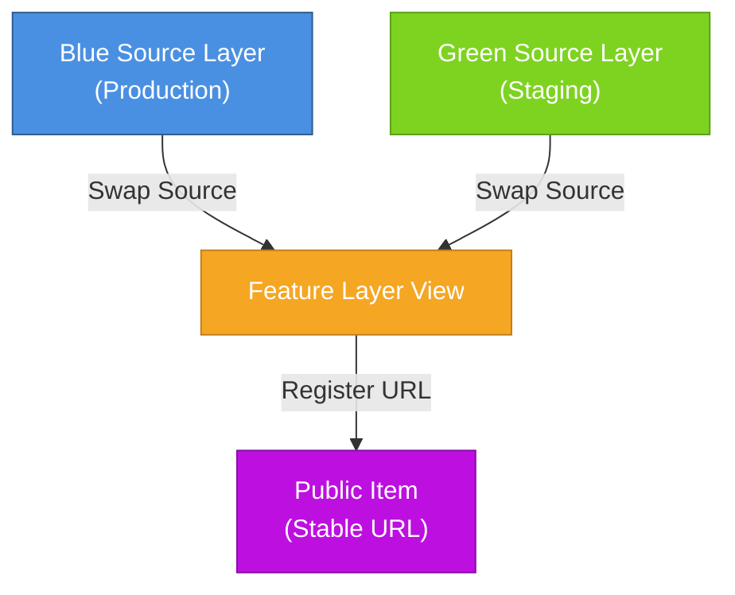

# Feature Layer Publishing Architecture: Three-Tier Design with Blue/Green Updates

This knowledge base article describes a production-ready architecture for publishing and maintaining feature services using a **three-tier design pattern** (source layers, view layer, and public item) with **blue/green deployment** for zero-downtime updates. This approach separates data management from presentation, maintains stable public URLs, and provides comprehensive control over cartographic properties throughout the data lifecycle.

## Overview

The blue/green publishing pattern creates redundant source feature layers (blue and green) that can be alternated during updates. Public-facing view layers switch between sources, ensuring continuous availability while updates are applied and validated. All cartographic properties—including symbology, scale visibility, and labeling—and all metadata are maintained on the public registration item, ensuring consistent visualization and documentation regardless of source layer changes.

### Benefits

- **Zero downtime** during updates
- **Rollback capability** if issues are discovered
- **Stable public URLs** that never change
- **Schema validation** before production release
- **Controlled field and data exposure** through views
- **Safe testing environment** alongside production

## Understanding the Three-Tier Architecture

This publishing pattern uses three distinct tiers, each serving a specific purpose in the data lifecycle:

### Tier 1: Source Layers (Blue & Green)

**Purpose:** Authoritative data storage and update staging

The source layers contain the complete, unfiltered dataset and serve as the foundation for all downstream views. By maintaining two identical source layers (Blue and Green), you can:

- Update one source while the other serves production traffic
- Validate new data in isolation before exposing it
- Maintain a working backup for instant rollback
- Apply schema changes without service interruption

**Key characteristics:**

- Not shared publicly
- Contains all fields, including sensitive data
- Serves as the single source of truth
- No direct user access

### Tier 2: Feature Layer View

**Purpose:** Controlled data access and transformation layer

The view layer acts as a gateway between raw source data and public consumption. It provides:

- **Security:** Hide sensitive fields (PII, internal IDs, draft attributes)
- **Filtering:** Apply geographic extent or attribute queries to show relevant subsets
- **Performance:** Limit data exposure to improve rendering speed
- **Flexibility:** Create multiple views from one source for different audiences
- **Decoupling:** Isolate public consumers from source layer changes

**Key characteristics:**

- References one source layer at a time (Blue or Green)
- Can be swapped between sources without URL changes
- Defines field visibility and filters
- Has its own stable REST endpoint

### Tier 3: Public Registration Item

**Purpose:** Permanent public-facing interface, cartographic configuration, and metadata repository

The registration item is the stable front door for your content. It provides:

- **URL permanence:** Item ID and URL never change, even during source swaps
- **Complete metadata management:** Descriptions, tags, thumbnails, terms of use, credits, and constraints
- **Cartographic properties:** Symbology, scale visibility ranges, and labeling expressions
- **Presentation layer:** Pop-up configurations, legends, and drawing styles
- **Discovery:** Appears in search results and content browsers
- **Integration point:** Referenced in web maps, apps, and external systems

**Key characteristics:**

- Points to the view layer's REST endpoint
- Contains all user-facing documentation, metadata, and styling
- Stores all cartographic configurations (symbology, scale-dependent rendering, labels)
- Maintains all item metadata independent of source layer updates
- Publicly shared (or shared with specific groups)
- Independent of source layer lifecycle

### Why Three Tiers?

This separation of concerns enables:

1. **Data management** (source layers) independent of **data presentation** (view and public item)
2. **Testing and validation** without affecting production users
3. **Gradual rollout** of updates with instant rollback capability
4. **Security** through controlled exposure of sensitive information
5. **Stability** of public URLs regardless of backend changes

## Architecture Pattern

## Prerequisites

- ArcGIS Online or ArcGIS Enterprise account with publishing privileges
- File geodatabase (FGDB) containing source data
- Understanding of [hosted feature layers](https://doc.arcgis.com/en/arcgis-online/manage-data/hosted-web-layers.htm) and [hosted feature layer views](https://doc.arcgis.com/en/arcgis-online/manage-data/create-hosted-views.htm)

## Phase 1: Initial Setup

### Step 1.1: Prepare File Geodatabase

Export your authoritative dataset to a file geodatabase to ensure:

- Clean schema with no legacy metadata
- Predictable field ordering
- Single feature class for simple publishing

**Steps:**

1. Create a new file geodatabase
2. Export your dataset to a single feature class
3. Validate field names, aliases, and data types
4. Zip the geodatabase

!!! warning "Only One Feature Class"

      It is important for there to be **only one** feature class in the file geodatabase. This affects the layer index (layer ID), which has to be consistent for the feature layer view (created later) to switch between the blue and green source feature layers.

!!! tip "Best Practice"

      Use meaningful feature class names that will become your layer name (e.g., `TransitStops`, `PollingLocations`).

### Step 1.2: Publish Blue Source Layer (Initial Production)

Create your first source feature layer:

1. In ArcGIS Online, navigate to **Content** → **Add Item** → **From your computer**
2. Upload your zipped FGDB
3. Select **Feature Layer (hosted)** as the item type
4. Name it clearly (e.g., `MyLayer_Source_Blue`)
5. Verify **Layer ID is 0** after publishing
6. **Do not share** this source layer publicly
7. Configure source layer settings:

      - **Editing:** Usually disabled for source layers
      - **Metadata:** Minimal (internal documentation only)

**Documentation:** [Publish hosted feature layers](https://doc.arcgis.com/en/arcgis-online/manage-data/publish-features.htm)

### Step 1.3: Publish Green Source Layer (Staging)

Create your second source feature layer with identical initial data:

1. Upload the same zipped FGDB again
2. Name it `MyLayer_Source_Green`
3. Apply identical settings as the blue layer
4. Keep it unshared

**Result:** Two identical source layers ready for blue/green swapping.

### Step 1.4: Create Public Feature Layer View

Feature layer views provide access to your data without duplication.

**Steps:**

1. Open the **Blue Source Layer** item page
2. Click **Create View Layer** from the overview tab
3. Configure the view:

      - **Definition query:** Filter data by SQL expression if needed
      - **Extent:** Limit geographic area
      - **Fields:** Hide sensitive or unnecessary fields
      - **Editing:** Set to read-only for public access

4. Name the view clearly (e.g., `MyLayer_Public_View`)
5. **Share appropriately** based on your audience

**Benefits of views:**

- Control field visibility
- Apply geographic and attribute filters
- Separate public and internal editing workflows
- Enable different sharing permissions

**Documentation:** [Create hosted feature layer views](https://doc.arcgis.com/en/arcgis-online/manage-data/create-hosted-views.htm)

### Step 1.5: Create Public Registration Item

Create a stable public item that references your view:

1. Navigate to **Add Item** → **From URL**
2. Paste the **Feature Layer View's REST URL** (e.g., `https://services.arcgis.com/.../.../FeatureServer`)
3. Set the public-facing title
4. Configure the item:

      - **Description:** Comprehensive documentation of the dataset
      - **Tags:** Include topic, geography, vintage, source
      - **Thumbnail:** Representative image
      - **Symbology:** Configure drawing styles, colors, and classification methods
      - **Scale Visibility:** Set minimum and maximum scale ranges for display
      - **Labels:** Define labeling expressions and text formatting
      - **Pop-ups:** Define attribute display and formatting
      - **Terms of Use:** Specify licensing and attribution

5. **Share with Everyone** (or appropriate audience)

!!! note "Important"

      All cartographic configurations (symbology, scale-dependent visibility, and labeling) should be set on this public item. These settings persist through all source layer updates and swaps, ensuring consistent visualization for end users.

!!! warning "Permanant Item"
      
      This is your permanent public item. Its URL and item ID never changes, regardless of source layer updates.

**Documentation:** [Add items](https://doc.arcgis.com/en/arcgis-online/manage-data/add-items.htm)

## Phase 2: Blue/Green Update Workflow

### Step 2.1: Prepare Updated Data

1. Export updated dataset to a new FGDB
2. Ensure schema consistency:

      - Field names match existing structure
      - Data types are compatible
      - Required fields are populated

3. Validate data quality
4. Zip the FGDB

!!! warning "Schema Changes Break Views"

   Removing fields in the source data will prevent swapping between the blue and green sources, and also can break the view. If this happens, recreate the source blue and green source feature layers and the view. Then, point the public facing feature layer at the new view's layer URL.

### Step 2.2: Update Inactive Source Layer (Green)

If **Blue** is currently active (serving the view):

1. Open the **Green Source Layer** item page
2. Click the **Update Data** tab
3. Select **Overwrite Entire Layer**
4. Upload your new zipped FGDB
5. Confirm the overwrite operation
6. Verify the data loaded correctly:

      - Check feature count
      - Review attribute values
      - Test queries

**Documentation:** [Overwrite hosted feature layers](https://doc.arcgis.com/en/arcgis-online/manage-data/overwrite-feature-layers.htm)

### Step 2.3: Validate Staging Data

Before switching production:

1. Create a **temporary test view** from the Green source layer
2. Add it to a test map
3. Verify:

      - Data displays correctly
      - Queries return expected results
      - Symbology renders properly
      - No schema mismatches

4. Delete the test view when validation is complete

### Step 2.4: Swap View Source (Blue → Green)

Switch your production view to the updated Green source:

1. Open the **Feature Layer View** item page
2. Navigate to the **Settings** tab
3. Scroll to **View Settings**
4. Click **Set Source Layer**
5. Select the **Green Source Layer**
6. Click **Save**
7. Verify the view now reflects updated data

!!! note "Important"
      
      The view URL and public item remain unchanged. Only the underlying source switches.

**Documentation:** [Manage hosted feature layer views](https://doc.arcgis.com/en/arcgis-online/manage-data/manage-hosted-feature-layer-views.htm)

### Step 2.5: Monitor and Validate Production

After the swap:

1. Test the public view in various applications
2. Monitor for errors or performance issues
3. Verify user workflows function correctly

### Step 2.6: Rollback If Needed

If issues are discovered:

1. Open the **Feature Layer View** settings
2. **Set Source Layer** back to **Blue**
3. Investigate issues in the Green layer
4. Fix problems and repeat steps 2.2-2.4

## Phase 3: Next Update Cycle

For the next update:

1. Update the **Blue source layer** (now inactive)
2. Validate staging data
3. Swap the view from Green → Blue
4. Continue alternating for each update

## Managing Schema Changes

### Compatible Schema Changes

These changes work with standard overwrite:
- Adding new fields
- Updating existing values
- Changing field aliases

### Breaking Schema Changes

These changes require additional steps:
- Removing fields
- Renaming fields
- Changing field data types

**Approach for Breaking Changes:**

1. Update both Blue and Green source layers with new schema
2. Recreate the view layer if field mappings are incompatible
3. Update the public registration item to point to new view URL (if necessary)
4. Communicate URL changes to users (last resort)

**Alternative:** Use the [ArcGIS API for Python](https://developers.arcgis.com/python/) `clone_items()` method to preserve item IDs while updating schemas.

## Metadata Best Practices

For Living Atlas-quality metadata, include:

### Required Sections

- **Topic:** Dataset subject matter
- **Geographic Extent:** Coverage area
- **Vintage:** Data collection date or period
- **Source:** Authoritative source and attribution
- **Update Frequency:** How often data refreshes

### Recommended Sections

- **Accuracy:** Spatial and attribute accuracy statements
- **Limitations:** Known issues or appropriate use cases
- **Contact Information:** Support resources
- **Credits:** Data providers and contributors

**Documentation:** [Item details](https://doc.arcgis.com/en/arcgis-online/manage-data/item-details.htm)

## Security Considerations

- **Never share source layers publicly** - Only views should be shared
- **Use views to hide sensitive fields** - Remove PII and internal identifiers
- **Apply appropriate item permissions** - Use organizational groups for controlled access
- **Enable HTTPS only** - Ensure secure data transmission
- **Review sharing settings regularly** - Audit who has access

**Documentation:** [Security and privacy](https://doc.arcgis.com/en/arcgis-online/administer/security-and-privacy.htm)

## Troubleshooting

### View shows no data after swap

**Cause:** Schema mismatch between new source and view definition

**Solution:**

1. Check that field names match
2. Verify data types are compatible
3. Recreate the view if necessary

### Public item shows old data

**Cause:** Browser caching or CDN propagation delay

**Solution:**

1. Clear browser cache
2. Wait 5-10 minutes for CDN refresh
3. Append `?timestamp=[current_time]` to REST requests

### Cannot overwrite source layer

**Cause:** Active editing sessions or dependent views

**Solution:**

1. Disable editing on the source layer
2. Ensure no users are actively editing
3. Try again after a few minutes

## Additional Resources

- [Hosted feature layer views](https://doc.arcgis.com/en/arcgis-online/manage-data/create-hosted-views.htm)
- [ArcGIS Online service limits](https://doc.arcgis.com/en/arcgis-online/reference/service-limits.htm)
- [Feature service performance optimization](https://enterprise.arcgis.com/en/server/latest/publish-services/windows/tuning-and-configuring-services.htm)
- [ArcGIS Developers documentation](https://developers.arcgis.com/)

## Summary

The blue/green publishing pattern provides enterprise-grade reliability for feature service management:

✓ **Zero downtime** updates  
✓ **Instant rollback** capability  
✓ **Stable public URLs** maintained indefinitely  
✓ **Safe staging** for validation  
✓ **Production-tested** approach  

By maintaining two source layers and swapping the view's source, you can confidently update data while ensuring continuous service availability.
